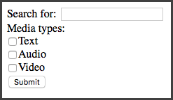

# Chapter 8: Form Formalities

In the previous chapter, we learned how to have Kitura display standard web pages via its templating system. In this chapter, we’ll use that knowledge to show some pages with forms on them, then demonstrate how to use Kitura to accept and act upon data from a form after the user submits it.

## Web Forms: A Review

Before we start looking at the Kitura side of things, let’s do a quick review of how forms work in browsers. (But if you’re already pretty well informed on this stuff and find yourself getting bored, feel free to skip ahead to the next section.)

The HTML `<form>` tag has an `action` attribute which contains the address that the browser will contact when the form is submitted. It also has an attribute called `method` which can have a value of either `get` or `post`.

If `method` is set to `get`, then when the form is submitted, the browser will encode the names and values of the form’s fields and append them to the end of the address in the `action` attribute. It will then make an HTTP GET request to that address, and the request will have an empty body.

For example, given the following HTML:

```html
<form method="get" action="/foo">
  <label>Search for: <input type="text" name="searchQuery" /></label><br />
  Media types:<br />
  <label><input type="checkbox" name="mediaType" value="text" />Text</label><br />
  <label><input type="checkbox" name="mediaType" value="audio" />Audio</label><br />
  <label><input type="checkbox" name="mediaType" value="video" />Video</label><br />
  <input type="submit" />
</form>
```

The browser will create a form which looks something like this.



Now let’s say we enter “Kitura” in the “Search for” field, check the “Text” checkbox, and then click the “Submit” button. The browser will build a query which looks something like:

```
http://example.com/foo?searchQuery=Kitura&mediaType=text
```

See how the `name` attributes of the `<input>` elements were combined with the values entered or selected by the user to build the URL?

So what happens if we go back to our form and change the `method` attribute of the `<form>` to `post`?

```html
<form method="post" action="/foo">
  …
```

When this form is submitted via an HTTP POST query, the browser will not put the form values in the URL. That means, if this page appears at the URL “http://example.com/“, the user will just be sent to “http://example.com/foo” no matter what values they enter or select in the form. The browser will, however, still serialize the data and send it as the body of the HTML request. This point is important because it means that the URLs created via forms that submit via GET are “bookmarkable” in the sense that, after submitting the from, if you add the resulting page to your browser’s bookmarks/favorites/hotlist and then revisit it later, you will see the same results of your submission. You could also share the URL with friends or family via email or text message or the like and know that, when they click on the web address, they will see the same results page that you did. This handy property does not hold true for results pages reached by a form that submits via POST; again, for our example form above, no matter what the user selects, the address of the resulting page will always be “http://example.com/foo”.

So if forms submitted by GET have this handy “bookmarkable” property, why aren’t all forms submitted by GET? Well, there are a couple of reasons why we’d still want to use POST for some forms. For example, there may be cases where we *don’t* want to have the form values inside the URL; for example, for a form a user would use to log in to a site that would have a password field. We don’t want that sensitive password to be sticking around in a URL for anyone to see or get access to! Also, note that browsers have a finite limit to the length of a URL that it will support. The limit varies by browser, but just as a rule of thumb, if there’s a chance someone could enter an arbitrarily large amount of data into your form - for example, if it has a `<textarea>` element for entering a large amount of text, a file upload field (an `<input>` tag with a `type` attribute of `file`), or just lots and lots of standard text fields - it’s best to have your form submit via POST rather than GET.

So when a POST request is done, as mentioned above, the form data is serialized into the body of a POST request to the server. There are two common methods by which this is done, and the method can be changed by setting an `enctype` value on the `<form>` tab. The default method used when an `enctype` is not present (as on our form above) is `application/x-www-form-urlencoded`, but the other common method is `multipart/form-data`. I won’t go into detail about how either of these work under the hood, but suffice it to say that if your form has a file upload field, you *must* set `enctype` to `multipart/form-data`. Otherwise, it’s safe to just let the browser use the default behavior by omitting the `enctype` attribute (which will cause it to use `application/x-www-form-urlencoded` by default).

So, to sum it up:

* `<form method="get">`
  * Will create a “bookmarkable” URL
  * Should not be used with `<textarea>` or `<input type="file">`
  * Should never be used on forms with fields for passwords or other sensitive information
  * Should not be used on forms with many elements
* `<form method="post">`
  * Will not create a “bookmarkable” URL
  * Can be used with large forms or forms with `<textarea>` elements
  * Should be used with forms with field for passwords or other sensitive information
  * Cannot be used with `<input type="file">`
* `<form method="post" enctype="multipart/form-data">`
  * As above, except *can* be used with `<input type="file">`

## Handling GET Submissions

All right, let’s get to coding. Start a new Kitura project. (We’ve been playing with that Chinook database project for a while, so if you’ve forgotten how to start a new one, feel free to go back and take a peek at chapter 1.)

In your `Package.swift`, import Kitura and KituraStencil. Let’s start by creating a route at the base path which just shows a template.

```swift
import Kitura
import KituraStencil

let router = Router()

router.setDefault(templateEngine: StencilTemplateEngine())

router.get("/") { _, response, next in
    try response.render("index", context: [:])
    next()
}

Kitura.addHTTPServer(onPort: 8080, with: router)
Kitura.run()
```
Create your Views directory and add an `index.stencil` which looks like the following. Part of it will look very familiar.

```html
<!DOCTYPE html>
<html>
  <head>
    <title>Search Page</title>
  </head>
  <body>
    <form method="get" action="/search">
      <label>Search for: <input type="text" name="searchQuery" /></label><br />
      Media types:<br />
      <label><input type="checkbox" name="mediaType" value="text" />Text</label><br />
      <label><input type="checkbox" name="mediaType" value="audio" />Audio</label><br />
      <label><input type="checkbox" name="mediaType" value="video" />Video</label><br />
      <input type="submit" />
    </form>
  </body>
</html>
```

Note that our form is going to submit via GET in this case.

We now want to build a route handler to handle the form submission. So how do we find those values? Well, I actually already mentioned how in this book, way back in chapter 2. Remember? You can find them in the `queryParameters` property of the `RouterRequest` object. Try adding this to your project.

```swift
router.get("/search") { request, response, next in
    guard let query = request.queryParameters["searchQuery"] else {
        response.send("Please enter a search term.")
        return
    }
    guard let mediaType = request.queryParameters["mediaType"] else {
        response.send("Please select at least one media type.")
        return
    }
    response.send("You searched for \(query) in the \(mediaType) type! Here's some results.")
    next()
}
```

Now load up the search form page and play around a bit.

You might notice a quirk if you select more than one of the “Media types” checkboxes. The resulting URL will look something like this:

```
http://localhost:8080/search?searchQuery=Kitura&mediaType=text&mediaType=audio
```

Note there are two values associated with the `mediaType` key. The text will look something like this:

```
You searched for Kitura in the text,audio type! Here's some results.
```

Yes, when there are more than one values for a key in a query, Kitura concatenates the values with a comma in order that they all fit into a single string. To work around this and get the individual values in these cases where there might be multiples, we need to split the value that Kitura gives us on the comma character. (I think this is silly - what happens if one of the values itself has a comma? - and have submitted a pull request to the Kitura project to rectify this. The pull request was accepted, but the changes have not yet appeared in a Kitura release as of this writing.) Let’s update our handler to deal with this.

```swift
router.get("/search") { request, response, next in
    guard let query = request.queryParameters["searchQuery"] else {
        response.send("Please enter a search term.")
        return
    }
    guard let mediaType = request.queryParameters["mediaType"] else {
        response.send("Please select at least one media type.")
        return
    }
    let separateMediaTypes = mediaType.split(separator: ",")
    for type in separateMediaTypes {
        response.send("Here are \(query) results in the \(type) media type.\n")
    }
    next()
}
```

And the result:

```
Here are Kitura results in the text media type.
Here are Kitura results in the audio media type.
```

That’s better.

## Handling POST Submissions

### POST Submissions with `enctype="application/x-www-form-urlencoded"`

For this sort of form, it would probably be best to keep it as a GET form, since it’s fairly simple and we don’t mind if the results page is bookmarkable. But we’ll turn it into a POST form just so we can see how they would work.

Now that you got this far, handling a POST submission done with the default `application/x-www-form-urlencoded` encoding is simple. Start by opening up your `index.stencil` and changing the `method` attribute of the `<form>` tag to `post` and save.

When we expect an HTTP request to have a body we want to deal with, we want to add an instance of the `BodyParser` class to the relevant route as middleware. After doing that, we can access that data in the `body` parameter of the `RouterRequest` object. That parameter is a instance of the `ParsedBody` enum which has cases and computed property corresponding to the type of content in the body. The one we’re interested in here is the `asURLEncoded` parameter which returns an optional `[String: String]` dictionary. No worries if this all sounds like word salad; it’s simpler than it sounds. Let’s go to the code.

```swift
router.post("/search", middleware: BodyParser())
router.post("/search") { request, response, next in
    guard let postValues = request.body?.asURLEncoded else {
        response.send("That shouldn't have happened.")
        return
    }
    guard let query = postValues["searchQuery"] else {
        response.send("Please enter a search term.")
        return
    }
    guard let mediaType = postValues["mediaType"] else {
        response.send("Please select at least one media type.")
        return
    }
    let separateMediaTypes = mediaType.split(separator: ",")
    for type in separateMediaTypes {
        response.send("Here are \(query) results in the \(type) media type.\n")
    }
    next()
}
```

So note in that first line where we instantiate the `BodyParser` class and add it to handle POST requests made to the “/search” path. Yes, this is the same path we used in the code to handle GET requests above. Remember from Chapter 2 that Kitura lets us define different handlers for the same route segregated by the HTTP request method; the code we wrote above to handle GET requests won’t run when a POST request is made to “/search”, and vice versa. Also recall that we can omit a path when defining middleware or other route handlers, so what I often like to do is just have `BodyParser` kick into action on *all* POST requests, regardless of path, by doing:

```swift
router.post(middleware: BodyParser())
```

Though whether you’d like to take this approach is up to you. (If you ever try to write a POST handler and get confused why `request.body` is empty, odds are the problem is that you forgot to add this middleware. This has happened to me more times than I’d like to admit.)

Inside the standard request handler, we have:

```swift
    guard let postValues = request.body?.asURLEncoded else {
```

Here’s another quirk of Swift, specifically with the handling of optionals. Going into all the quirks of Swift optionals is outside the scope of this book, but suffice it to say that it’s something which often confuses new Swift developers - it sure confused me! The short of it here is that both the `body` property and the `asURLEncoded` property of the `body` property are optionals. The question mark after the `body` part means that the Swift compiler will check to make sure that `body` itself is not nil before it attempts to resolve its `asURLEncoded` property; if `body` *is* nil, it just sends nil down the line to `postValues` rather than trying to continue. The short of the short of it is that `postValues` will be nil if either `request.body` *or* `request.body.asURLEncoded` are nil.

Note that, just as with `queryParameters`, in the case that there are multiple values for one key in the data, those values will be concatenated with commas, so we do the same splitting as we do in our GET submission code.

Go ahead and build your project and test it out. You should see that the behavior is exactly the same as it was when you were making GET requests, except that the path won’t have the query string.

### POST Submisssions with `enctype="multipart/form-data"`

Okay, let’s round out the trifecta by seeing how we’d take a form submission with the `multipart/form-data` encoding. Let’s tweak our template again to add the `enctype` attribute, and change the `action` path to something else while we’re at it. We’ll also change the `action` path to something else. 

```html
    <form method="post" action="/multipart" enctype="multipart/form-data">
      <label>Search for: <input type="text" name="searchQuery" /></label><br />
      Media types:<br />
      <label><input type="checkbox" name="mediaType" value="text" />Text</label><br />
      <label><input type="checkbox" name="mediaType" value="audio" />Audio</label><br />
      <label><input type="checkbox" name="mediaType" value="video" />Video</label><br />
      <label>A picture of something silly: <input type="file" name="sillyPicture" /></label><br />
      <input type="submit" />
    </form>
```

Now our router handler is going to be quite a bit different than the two cases above. We’re going to find our values in `request.body?.asMultiPart`, and it’s going to be an array of `Part` structs. Each struct will have a `name` property which corresponds to the name of our field in the HTML form, and a `body` property which contains the value the user entered as a `ParsedBody` enum. Most interesting for the case of file fields, there’s also a `filename` property which will contain the filename of an uploaded file (for other fields, it will be a blank `String`), and a `type` property which corresponds to the MIME type of the uploaded file. For example, if the file uploaded was a JPEG-formatted picture, it will be `image/jpeg`. (For non-file fields, this will be `text/plain`.)

So what we’ll do is loop through the parts and examine the `name` parameters to make sure all the parts we want can be found. We’ll use a switch case on the `body` parameters of the parts, which, recall, is a `ParsedBody` enum, even though (due to Swift quirkiness) we haven’t used it as one yet. You’ll see that this all makes the code quite a bit more verbose; another reason why you may wish to avoid using `mutlipart/form-data`-encoded forms when it’s not necessary (when there’s no file upload field).

```swift
router.post("/multipart", middleware: BodyParser())
router.post("/multipart") { request, response, next in
    guard let postValues = request.body?.asMultiPart else {
        response.send("That was unexpected.")
        return
    }
    var mediaTypes: [String] = []
    var searchQuery: String?
    var sillyPicture: Data?
    for part in postValues {
        switch part.body {
        case .text(let text):
            if part.name == "mediaType" {
                mediaTypes.append(text)
            }
            else if part.name == "searchQuery" {
                searchQuery = text
            }
        case .raw(let data):
            if part.name == "sillyPicture" {
                sillyPicture = data
            }
        default:
            response.send("Unexpected part type.")
        }
    }
    guard let _ = searchQuery else {
        response.send("Please enter a search term.")
        return
    }
    guard mediaTypes.isEmpty == false else {
        response.send("Please select at least one media type.")
        return
    }
    guard let _ = sillyPicture else {
        response.send("Please upload a silly picture.")
        return
    }
    for type in mediaTypes {
        response.send("Here are \(searchQuery!) results in the \(type) media type.\n")
    }
    // Do something interesting with the sillyPicture here…
    next()
}
```

## Extra Credit

Want an extra challenge? Now that you know how forms work, go back and open up your music database project from previous chapters and add a search page allowing users to search for albums, artists, and songs by name. This will involve using the form handling stuff introduced in this chapter plus the templating and Kuery stuff from earlier chapters, so it should be a good demonstration of all the fun stuff you’ve learned so far. Have fun!
