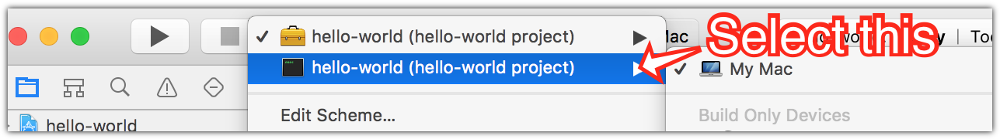

# Chapter 1: Hello World

> TODO
> * Test on Ubuntu
> * Confirm `--server-response` is the right wget flag

Let’s create a classic [Hello World](http://www.catb.org/jargon/html/H/hello-world.html) example.

Create a new Swift project by doing the following in a command line shell:

    $ mkdir hello-world
    $ cd hello-world
    $ swift package init --type=executable

Now open up the `Package.swift` file and add a dependency for Kitura. The end result should look like this.

    // swift-tools-version:3.1
    
    import PackageDescription
    
    let package = Package(
        name: "hello-world",
        dependencies: [
            .Package(url: "https://github.com/IBM-Swift/Kitura.git", majorVersion: 1)
        ]
    )
    
Have the Swift Package Manager fetch Kitura and add it and its dependencies to your project.

    $ swift package fetch

If you’re on macOS and wish to use Xcode as your code editor, now’s the time to create a new Xcode project and open it up. (If you’re not on macOS or not using Xcode, ignore the following.)

    $ swift package generate-xcodeproj
    $ open hello-world.xcodeproj

Now note that your project won’t build properly in Xcode unless you change the scheme to be your application. I don’t know why this is; if it’s a glitch in Swift Package Manager, Xcode, or both. At any rate, you have to do it ever time you use `generate-xcodeproj`. From the scheme menu to the right of the “stop” button, select the CLI application scheme as indicated by the tiny black terminal window.

Also, note that Xcode will refuse to acknowledge your dependencies exist until after you build your project for the first time - so Xcode will immediately flag the first line of the following code sample, `import Kitura`, with a “No such module ‘Kitura’” error. Just build your project (select “Run” from the “Product” menu or press the “Play” button in the window toolbar) after entering that line to make the error go away.

Okay, let’s add some code. Open up the `Sources/main.swift` file in your editor. Delete what SPM has put in there by default and enter the following:

    import Kitura
    
    let router = Router()
    
    router.get("/") { request, response, next in
        response.send("Hello world!\n")
        next()
    }
    
    Kitura.addHTTPServer(onPort: 8080, with: router)
    Kitura.run()

(Note: If you already have a network service running on IP port 8080 on your development machine, try another port number, such as 8081 or 8090. Remember to substitute that number for 8080 in all examples throughout this book.)

Now build and run your project. Back in your console window, enter:

    $ swift build

If all goes well, the last line will be:

    Linking ./.build/debug/hello-world
    
That’s where your compiled binary was saved. So let’s run that.

    $ ./.build/debug/hello-world

If all goes well, the program will execute without any output.

Now open up a second terminal window and hit your new Kitura site!

    $ curl localhost:8080/
    Hello world!

Note that I will use the Curl command line client for this and other examples in this book, but you can of course use wget if you prefer it or simply don’t have Curl installed.

    $ wget localhost:8080/
    Hello world!

Aside from just the body of your response, your Kitura site is sending standard HTTP headers. You can check this by adding the `--include` flag to your Curl command. (If you’re using wget, add a `--server-response` flag.)

    $ curl --include localhost:8080/
    HTTP/1.1 200 OK
    Date: Sun, 27 Aug 2017 03:37:28 GMT
    Content-Length: 13
    Connection: Keep-Alive
    Keep-Alive: timeout=60, max=99

    Hello world!

Now just for fun, let’s see what happens if we access a path other than “/“ on our server. Let’s try the “/hello” path:

    $ curl --include localhost:8080/hello
    HTTP/1.1 404 Not Found
    Date: Sun, 27 Aug 2017 03:39:23 GMT
    Content-Length: 18
    Connection: Keep-Alive
    Keep-Alive: timeout=60, max=99
    
    Cannot GET /hello.

Oh, we got a 404 error. You may be able to guess why, but if not, I’ll explain it later in this chapter.

Back in the terminal window that’s running your program, you can stop execution by typing Control-C, or ^C in standard Unix notation.

Note that Xcode users can run your project by using the “Run” command in the “Product” menu or by pressing the “Play” button in the toolbar rather than using the command line to build and execte your compiled project, and indeed this process is generally faster for Xcode users. You should also know how to do it via the command line, however. You can try it now, but don’t forget to halt the program in the terminal first.

## So what did we do?

First, we created a new project with Swift Package Manager. The full scope of what SPM can do is outside the scope of this book; if you are unfamiliar with it, have a look at the “[Swift Package Manager basics](../appendices/spm-basics/spm-basics.md)” appendix in this book for the basics as far as Kitura development is concerned. As fair warning, later chapters in this book will not give you a step-by-step process for adding new packages to your project and instead merely say something like “add package X to your project.”

Then we added some code. Let’s go through it line by line.

    import Kitura

We are importing the Kitura module into the scope of `main.swift` for further use by our code.

    let router = Router()

We are instantiating a new Router object, which is provided by Kitura. Routers will be covered in more depth in the next chapter. For now, know that routers are how we define paths that our site will listen for and what happens when a request for that path is made to the server.

    router.get("/") { request, response, next in

We are creating a handler for the “/“ path; specifically, for GET HTTP requests made to the “/“ path. (We’ll learn how to handle other types of requests in a later chapter.) Note that in our code, this is the only path for which we are creating a handler. This is why we got a 404 error when we tried the “/hello” path above. (Up for a bit of experimentation? Try changing this to “/hello” or any other path and rebuild your project. Just remember to keep that slash at the beginning of the path.)

The part that begins with a curly brace is an escaping closure parameter. It’s actually a closure which is passed as a parameter to the “get()” method on the Router object instance, even though it is outside of the parentheses. If you’re like me, this syntax is pretty bizarre, but you’re going to want to get used to it, because Kitura uses it everywhere. Have a look at the “Escaping Closures” section of *The Swift Programming Language* for more information on what’s being done here. For now, if it helps, think of this line being functionally equivalent to:

    router.get("/", handler: (request: RouterRequest, response: RouterResponse, next: RouterHandler) {

…even though that code won’t actually work.
    
Finally, `request, response, next in` specifies that our closure that we just began has three parameters passed to it: `request`, which is a Kitura RouterRequest instance with information about the incoming request; `response`, which is a Kitura RouterResponse object with information about the response we want to send to the client that made the request; and `next`, which is itself a closure. I’ll explain that `next` parameter more later in this chapter; first, we should explain the rest of the code in this example.

        response.send("Hello world!\n")

The first line in our handler simply sends a string composed of “Hello world!” followed by a standard line break character to the client. It does this by invoking the `send()` method of the RouterResponse instance that was passed to our handler.

        next()

Call the next handler that can respond to this route. Again, I will go further in depth to the `next` parameter later in this chapter.

    }

End our route handler closure.

    Kitura.addHTTPServer(onPort: 8080, with: router)

Tell Kitura that we want to start an HTTP server that’s listening on port 8080, and we want it to use the paths and handlers we defined to our Router instance `router`.

    Kitura.run()

Finally, start the HTTP server. The server will continue running until either a major error occurs or the process is interrupted (as you do when you type Control-C into the terminal where Kitura is running).

Congratulations, you are now a Kitura hacker! The rest of the book will basically just be expanding on what we’ve learned here.

## About that `next` parameter…

The `next` parameter needs further explanation. In Kitura, it’s perfectly valid to have more than one handler for a given route. You can think of each handler which is going to respond to a request as being in a chain. The next link in the chain - the next handler that should be invoked for the route - is passed in as the `next` parameter. That’s why it’s important to remember to always include `next()` after normal execution of the code in your handler. The exception - when you do *not* want to invoke `next` - is when an error has happened and we want to abort any further “normal” response to the client; for example, if the user is trying to access a resource they don’t have access to, we should send their client a 403 error and stop any further execution.

You can test this “chain” behavior by adding a second handler to our code. Add this right before the `Kitura.addHTTPServer(onPort: 8080, with: router)` line:

    router.get("/") { request, response, next in
        response.send("And hello again!\n")
        next()
    }

Our code now has two simple handlers for the “/“ path. (If you experimented by changing “/“ to “/hello” or some other path in the first route handler above, either change it back or have this handler use that same new path; either way, make sure the first parameter to the `get` method is equivalent). Now do another request in the command line, and check out how the output has changed.

    $ curl localhost:8080/
    Hello world!
    And hello again!

See? Our handlers fired one after the other, as expected. But now go back to the first handler and comment out or delete the `next()` line. Build your project and test your site again:

    $ curl localhost:8080/
    Hello world!

Oops. As you can see, failing to call `next()` from our first handler means our second one didn’t get invoked. So don’t forget your `next()` line!

To help them not forget, many coders will wrap their `next()` lines in a `defer` block at the beginning of their callbacks, like this:

    router.get("/") { request, response, next in
        defer {
            next()
        }
        response.send("Hello world!\n")
    }

Code in the `defer` block is executed right before the function returns, no matter where or how the function returns, so the code in this handler closure is functionally equivalent to the first one we wrote above. (See the “Defer Statement” section in *The Swift Programming Language* for more information on this structure.) However, since we don’t *always* want to call `next()` - as above, there will be important exceptions - I don’t want you to get in the habit of using `defer` blocks in your handlers this way, and will not use it in further examples in this book. You will see this pattern used frequently in others’ Kitura code around the web, however, so I feel it’s important to explain what’s happening in that code.
